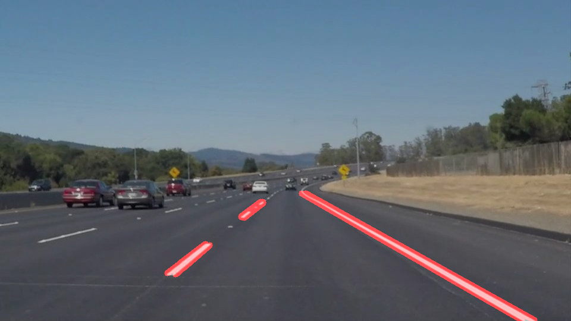
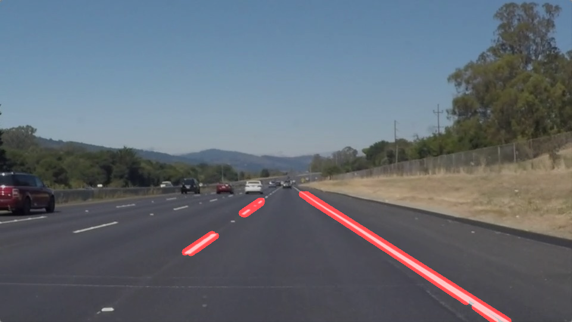
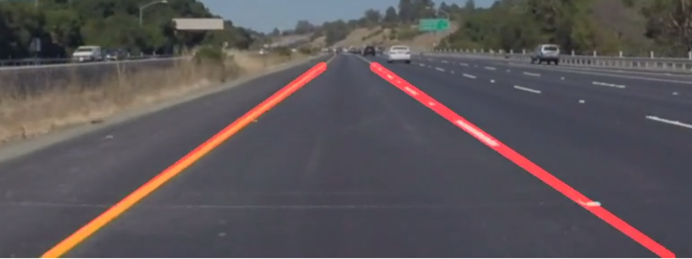

# **Finding Lane Lines on the Road**

**Finding Lane Lines on the Road**

The goals / steps of this project are the following:
* Make a pipeline that finds lane lines on the road
* Reflect on your work in a written report

### Reflection

### 1. Pipeline.
My pipeline was:
- convert image (or video-frame) to grayscale;
- apply Gaussian blur to smooth the image;
- apply Canny edge detection (it will apply additional blur, find gradients and find good edges);
- choose region of interest (car camera is fixed, we don't need the whole image);
- find lines using Hough lines algorithm;
- draw lines on the image;

Resulted line segments:

After getting good line-segments, I needed to get a solid long lines (left and right). For this I first just separated left and right line segments by their slope. Then I averaged line positions and extrapolated on the mask boundaries. Than was a problem: right line on the videos were constantly jumping in different directions. Then I removed outlier slopes, which are too far from the mean (several standard deviations from the mean), and use mean slope for drawing the lines. The hardest part was to select parameters for Hough transformation.

Final result:

### 2. Potential shortcomings with the current pipeline

The biggest shortcoming is that lines are still not that stable on videos.

Another problem is that this pipeline not dealing good with the curved lines (as I realized by trying challenge video).

### 3. Possible improvements to the pipeline

A possible improvement would be to average lines over the frames.
